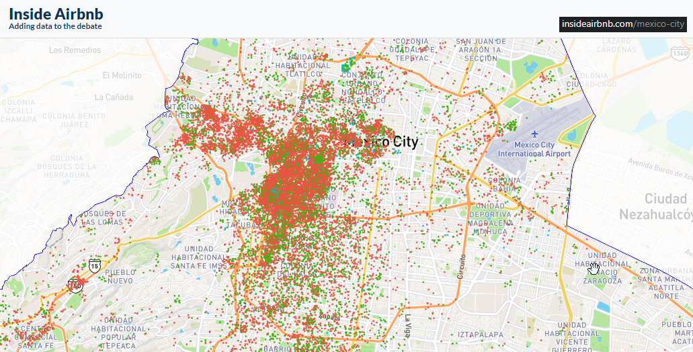
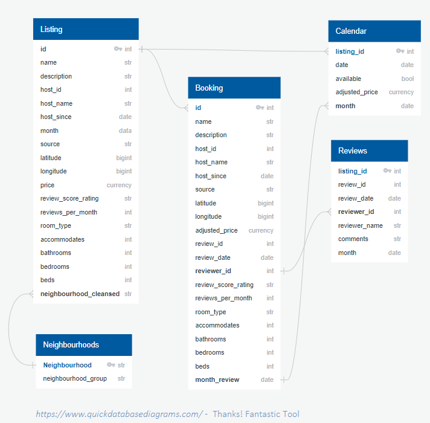
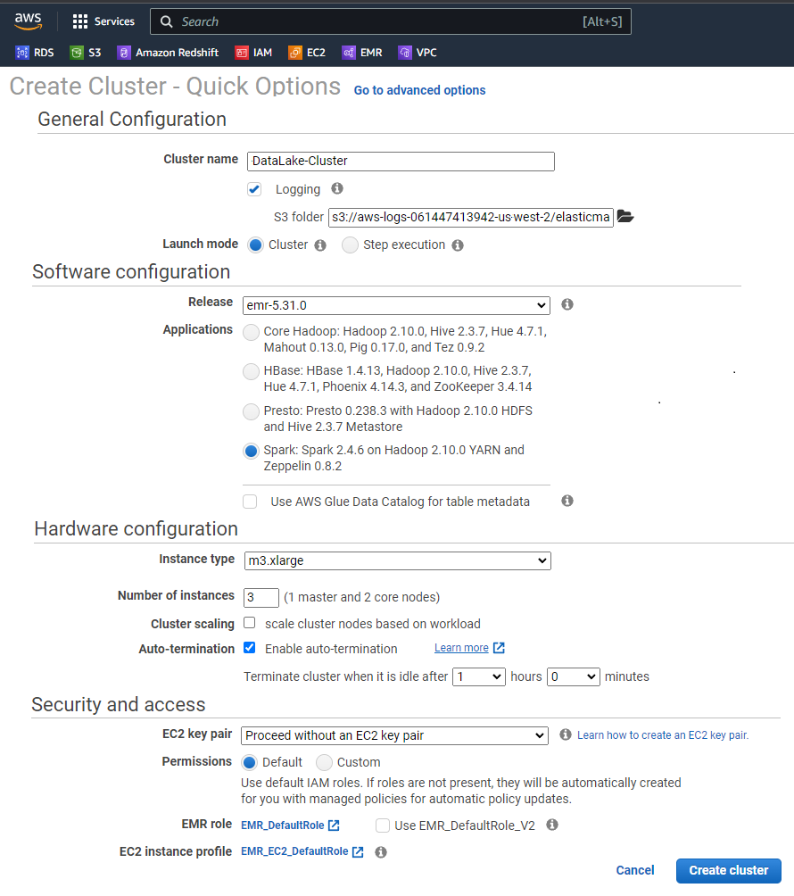

# Data Engineering's Project CAPSTONE :earth_americas:
Closing Project "Capstone" on a EMR Cluster &amp; Spark on Hadoop (AWS - Amazon Web Services) of the **UDACITY Nanodegree in DATA ENGINEERING** Course.

## Overview :information_source:
* [Introduction](#introduction)
* [Data Schema](#data-schema)
* [Files list](#files-list)
* [Conclusion](#Conclusion)
* [Getting Started](#getting-started)


## Introduction :pencil2:

I am running my Capstone project with public data from "Inside Airbnb", in specific with the data of Mexico City. 
All the files required are downloadable from [https://insideairbnb.com/get-the-data/](https://insideairbnb.com/get-the-data/).  

**Hint:** The compressed files `(*.gz)` could be uploaded directly into workspace. On the exploration Jupyter Notebook there are a set of comands to uncompress the files directly on the (Udacity) Jupyter Workspace. 

<br>

| FILE NAME | DESCRIPTION | SIZE |
| ----- | ----- | ----- | 
| calendar.csv.gz | Detailed Calendar Data | 26.5 MB > 463 MB | 
| listings.csv | Summary information and metrics for listings in Mexico City (good for visualisations) | 3.75 MB |
| listings.csv.gz | Detailed Listings Data | 15.4 MB > 60.7 | 
| neighbourhoods.csv | Neighbourhood list for geo filter. Sourced from city or open source GIS files. | 275 B | 
| reviews.csv | Summary Review data and Listing ID (to facilitate time based analytics and visualitaion linekd to a listing) | 18.5 MB | 
| reviews.csv.gz | Detailed Review Data | 86.7 MB > 226 MB | 

_Worked with last update of data: 29 March 2023_
<br>



### Choice of Tools & Technology for the project  

**Common Intro**  
The use of Pandas allows an easy data pre-processing as well visualistion (especially in the exploring phase case). It is helpful to efficiently load and manipulate data. Further in the project, instead of pandas dataframes ("_df"), it is recommended to use Spark dataframes ("df_") to allow distributed processing using for example Amazon's Elastic Map Reduce (EMR). 

**My Selection**  
I did select to setup my project with `Spark` (AWS Services), a `JUPYTER Notebook` for the exploration of the data (like a "Playground" to try steps and document results directly). A second Notebook for the final project executable project documentation in a clean way. For a direct execution of the ETL an `etl.py` Python file is also there.
At the execution of the JUPYTER Workbook it will be `pyspark` used, instead of using Redshift and Airflow.  

Looking about the cost factor Redshift is expensive, for another we can load the cleaned data on the fly without building tables and filling them to an from S3 with Apache Spark is easy and does have the ability to handle large data volumes and perform big data analytics through his distributed processing. This is a great advantage of using Spark on this!  

The Inside Airbnb dataset is more a static dataset, less frequently as hourly or daily. An update monthly is enough. 

[top](#summary)

## Data Schema :sparkles:

### Schema design and ETL pipeline

A star schema as database design decision does allow a simple and effective way to organize data for querying and reporting. Because of the CSV-files there is a organisation in a way that favoured this.  

The star schema does consist of 1 *Fact* table (booking) and 4 *Dimension* tables (calendar, listing, neighbourhoods and reviews). For the *Dimension* tables they are 4 source files in CSV format of **calendar**, **listings**, **neighbourhooods** as well of **reviews** are on the (local:) Udacity Workspace or (online:) at the S3 on AWS uploaded.

  
_Database Model Diagram draw with and sponsored by www.quickdatabaseddiagrams.com_


## Datasets used
The datasets used are retrieved (a) from the Udacity Workspace - used through the Jupyter Notebook or/and (b) from the s3 Bucket - used with the ETL execution of the `etl` python script. At the end, there are four datasets namely `calendar`, `listings`, `neighbourhoods` and `reviews`. 
<font color="red">[***] Mas mas y otro poquito mas...</font>


## Motivation :pencil2:
The intention of this project is to provide to an analytics team access to the data model that allows easily to query and extract insights. It means at the end, have combined tables as a efficient and fast source for a 'Self Service Report'-Dashboard to be done with Microsoft Power BI (my daily work) or maybe featured on [AWS QuickSight](https://aws.amazon.com/de/quicksight/).  

**Tipp:** Microsoft is bringing in Mai '23 a library which does allow to compell [Microsoft Power BI reports DIRECTLY at the Jupyter Notebook](https://powerbi.microsoft.com/en-us/blog/create-power-bi-reports-in-jupyter-notebooks/s) (_Whou!, absolutely a game changer_).


## Files list :paperclip:

Use this files for creation of the database Sparkifydb withhin the JUPYTER Workplace with the required tables.  

Following is a list or required files to execute the project: 
* **README.md** - this file as project description
* **aws-access.cfg** - configuration properties for (AWS) remote execution
* **Capstone-A-Exploration-Notebook.ipynb** - Jupyter Workbook: Data Exploration as well an easy execution of ALL (separated) steps and scripts
* **Capstone-B-Project-Notebook.ipynb** - Jupyter Workbook: Clean Project description with some representative exections  
* **Data-Dictionary-Inside-Airbnb-(Mexico-City).pdf** - An overview of Data Dictionary and Description of columns  
* **etl.py** - Main python script with the processes `create_spark_session`, `read_csvs`, `data_preparation`, `data_types`, `pre_processing_s3`, `write_to_s3` and `data_quality_check`


## Conclusion :checkered_flag:

To say in one word? "Heavy"! This was really a good challenge because of the tricky war to examine and explore data, like a blind. You will only see parts of the content and as you move forward, your will see more ... or less :-/  
It was a good challange to explore your own way to move forward on the project! All depends also from the availibility of the IT-Systems. If you work directly on the Jupyter Workbook on the Udacity Environment, it depends on how the Notebook is opened. Does it open in a separated browser tab, den spontanously the Notebook will lost connection, kernel does not work anymore, you can not save and sometimes get scarry, but stay cool, on the other tab just refresh and restart the Udacity Workspace and then you could again save. My recomendation to you: Use a Version label and download time-to-time a writen version of your Notebook, to be save you have still your developed stuff.  

From tooling it wasn't so complicated. The only is, that depending of the size of the data ( in my case ~4 Mio rows ) there will be lot of time outs and you need to restart the kernel and execute your Jupyter Notebook. By the way, fantastic possibility to execute code and get the results inmediately documented. 
I work a lot with "small" project, and here was also a challenge to keep the local repository updated with my personal backup and also commiting stuff to the online GutHub repository. As I do not use "git" everyday get the chance to use it and keep "fresh" on the use, then it will be step-by-step simpler.  

It was very interesting to work with the "Airbnb" data, and if you find data from your city then you will get more familiarized with the purpose and way on how to handle it. Finally, the whole importing, data verification, as well dynamically data modelling (including relationships between tables) was very very easier for my to do it in my daily business tool, Microsoft Power BI. It does help a lot to understand the way, content and problems handling data.  

Hope you guys and girls outside in the programming world, to give with this also a guidance and an overview of the (possible) content of the project!  

Thanks Udacity!


[top](#summary)

## Getting Started :book:

### Prerequisites

- AWS Account
- Set your AWS access and secret key in the config file `aws-access.cfg`  
  
```
AWS_ACCESS_KEY_ID = <your aws key>
AWS_SECRET_ACCESS_KEY = <your aws secret>
```

## Setup an EMR on AWS - How to run this project on AWS EMR?

### Create a Data Lake with Spark and AWS EMR

To create an Elastic Map Reduce (EMR) data lake on AWS, use the following steps:

1. Create a ssh key-pair to securely connect to the EMR cluster that we are going to create. Go to your EC2 dashboard and click on the key-pairs. Create a new one, you will get a .pem file that you need to use to securely connect to the cluster.

2. Next, we will create an EMR cluster with the following configuration. Here EMR operates Spark in YARN cluster mode and comes with Hadoop Distributed file system. We will use a 4 cluster node with 1 master and 3 worker nodes.

3. We will be using the default security group and the default EMR role `EMR_DefaultRole` for our purposes. Ensure that default security group associated with Master node has SSH inbound rule open, otherwise you won't be able to ssh. 




### Terminal commands 

* Execute the ETL pipeline script by running:
    ```
    $ python etl.py
    ```


<br>


[top](#summary)


## Author :male_detective:

Best regards  
UDACITY [Data-Engineering]  
Student "MrMorphy" [GitHub Profile](https://github.com/MrMorphy)

GitHub Project  
https://github.com/MrMorphy/udacity-course-proj-final-capstone/blob/main/README.md
